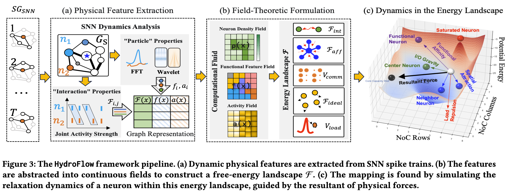
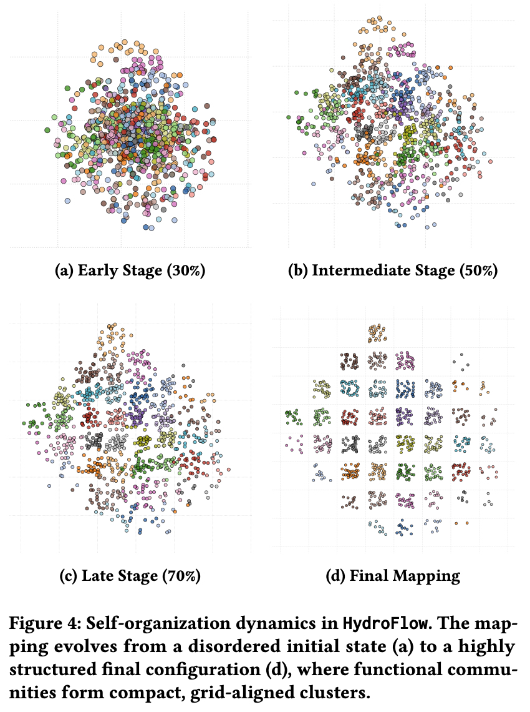

# HydroFlow: A Langevin Dynamics Inspired Mapping Framework for SNN to NoC-based Neuromorphic

This repository contains the official implementation of the paper: **"HydroFlow: A Langevin Dynamics Inspired Mapping Framework for SNN to NoC-based Neuromorphic"**.

HydroFlow recasts the NP-hard problem of mapping Spiking Neural Networks (SNNs) to Network-on-Chip (NoC) hardware as a physics-guided dynamic evolution. We model the SNN as a "computational fluid" whose optimal mapping emerges as its lowest-energy state. This evolution is governed by a Generalized Langevin Equation, unifying all competing objectives—from dynamic coupling to hardware constraints—into a single free-energy functional.

The result is a high-performance, scalable mapping algorithm that is orders of magnitude faster than traditional methods while achieving superior quality by directly modeling the spatiotemporal dynamics of SNNs.





## **Note for Reviewers**

Thank you for reviewing our work. This repository provides a streamlined version of our code specifically for reproducing the **MLP-10 benchmark results** presented in our paper, we have included only the necessary code and data for this specific experiment. 

The complete, generalized codebase for all benchmarks will be made publicly available upon the acceptance of our paper.


## One-Click Reproduction  `main.py`

It is designed for easy sharing and one-click reproducibility by providing a direct execution path for the core algorithm.

Important Note on Runtimes
Our implementation uses the Numba JIT (Just-In-Time) compiler for significant performance acceleration. As a result, the very first time you run the script, there will be a one-time compilation overhead, making the initial run slower.
Subsequent runs will use the cached, compiled code and will reflect the true, much faster execution time reported in our paper. Please consider the runtime from the second execution onwards for an accurate performance assessment.

### Project Structure

```
HydroFlow-Reproducibility/
├── rl_algo/            # Main source code for HydroFlow and utilities
│   ├── HydroFlow_Mapping.py # Core algorithm implementation
│   ├── graph_partitioning.py # Algorithm wrapper
│   ├── build_activity_graph_online.py # Graph construction logic
│   └── 
├── main.py             # Main execution script to run the mapping
└── README.md
```

### Dependencies

It is recommended to use a Conda or other virtual environment.

```bash
pip install torch numpy networkx numba rich scipy scikit-learn joblib tqdm pywavelets hurst
```


## Output

After the run completes, a new results directory will be created. A message will be printed to the console indicating the exact path:

> All output files have been saved to the directory: **`result/rl_mapper_output/hydroflow_mapping/`**
